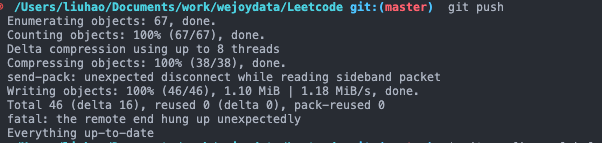

递归，估计时间复杂度：
子行为规模一致，可以使用如下公式估计：T(N)  = a * T(N/b) + O(N ^ d) ,其中 a b d 都是常数 

* log a (b) > d  时间复杂度 N ^ log a(b)
* log a (b) < d  时间复杂度 N ^ d
* log a (b) = d  时间复杂度 ( N ^ d ) * log N

## 常见问题处理
  1 异常：
  
  设置远程git
  sudo git remote set-url origin https://e3qZsY1MZYFrEAfAA7XR7tIvMbeWB3YIoX8fitrMpEPD5DQGK5Rl08n2ZZ@github.com/Appetence/leetCoode.git
  2 异常：
  
  设置缓存区大小
  git config --global http.postBuffer 524288000
