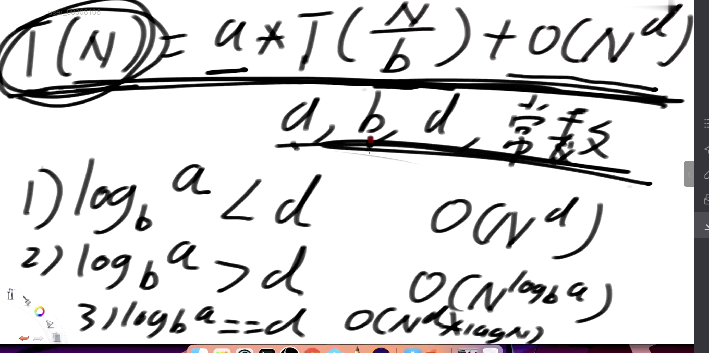

## Master 公式 只针对 子问题规模一致的场景

    求解时间复杂度

T(N) = a * T(N/b) + O(N^d)
a b d 
|    判断 |                时间复杂度 |
| ---- | ----|
|log b a < d        | O(N^d)|
|log b a > d       |  O(N ^ log b a)|
|log b a == d     |   O(N^d * log N )|
o
### 算法空间稳定性:
    排序后数据节点的相对顺序不发生改变
#### 无稳定性
选择，快排，堆排序
### 有稳定性（可以做到稳定）
冒泡，插入，归并，基数排序，计数排序，桶排序

| 算法 | 时间 | 空间 | 稳定性 |
|-----|-----|-----|-----|
|选择|O(N ^ 2)|O(1)|x|
|冒泡|O(N ^ 2)|O(1)|✅|
|插入|O(N ^ 2)|O(1)|✅|
|快排|O(N * logN)|O(logN)|x|
|归并|O(N * logN)|O(N)|✅|
|堆|O(N * logN)|O(1)|x|

回文：stack
快慢指针：快指针一次2步，慢指针一次1步